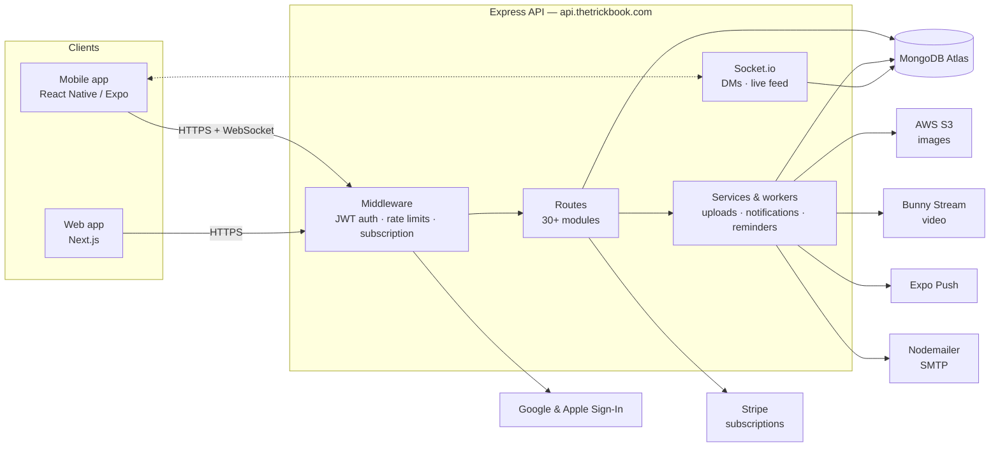

# TrickBook Backend

REST API and real-time messaging server for [TrickBook](https://thetrickbook.com) — the skateboarding trick-tracking and social platform.


## Overview

This service is the API layer for both the TrickBook mobile app (React Native/Expo) and the web app (Next.js). Production runs at `api.thetrickbook.com`.

- **REST API** — 30+ Express route modules covering users, trick lists, the Trickipedia encyclopedia, skate spots, spot lists/reviews, feed, blog, payments, media, analytics, and more.
- **Authentication** — JWT-based auth (email/password with bcrypt), plus Google Sign-In (`google-auth-library`) and Apple Sign-In (`apple-signin-auth`). Rate limiting on login/registration via `express-rate-limit`.
- **Real-time messaging** — Socket.io powers direct messages and live feed updates.
- **Push notifications** — Expo push via `expo-server-sdk`, with background workers for delivery-receipt polling and scheduled practice reminders.
- **Media** — image uploads to AWS S3 (`multer-s3` + `sharp` processing); video upload/streaming through Bunny Stream.
- **Payments** — Stripe subscriptions (freemium premium tier) with webhook handling.
- **Spots** — Google Places integration for skate spot data and photos.
- **Email** — Nodemailer for contact form and account emails.
- **Bot chat** — the "Kaori" assistant (`/api/bot-chat`), backed by an LLM provider and an optional local TTS sidecar (`kith-voice/`).

### Domain terminology

- **Trickipedia** (`/api/trickipedia`) — global, admin-curated encyclopedia of tricks (not user-specific).
- **Listings / trick lists** (`/api/listings`) — a user's collections of tricks for tracking personal progress.
- **Listing** (`/api/listing`) — CRUD on individual tricks within a user's trick list.

## Architecture



The entry point (`index.js`) opens a single shared MongoDB connection (`db.js`), mounts every route module with that connection injected, attaches Socket.io to the HTTP server, starts the notification workers, and handles graceful shutdown on `SIGTERM`/`SIGINT`. The app runs behind a proxy (`trust proxy` is set), and CORS is restricted to an allowlist of web origins — mobile clients are unaffected.

## Tech Stack

- **Runtime:** Node.js 20 (`.nvmrc`), Express 4
- **Database:** MongoDB (native driver + Mongoose)
- **Real-time:** Socket.io 4
- **Auth:** `jsonwebtoken`, `bcrypt`, `google-auth-library`, `apple-signin-auth`
- **Media:** AWS SDK (S3), `multer-s3`, `sharp`, Bunny Stream (via `axios`)
- **Payments:** Stripe
- **Notifications:** `expo-server-sdk`, Nodemailer
- **Hardening:** `helmet`, `compression`, `express-rate-limit`, `joi` validation
- **Tooling:** Biome (lint + format), Husky + lint-staged pre-commit hooks, nodemon
- **Ops:** PM2 (`ecosystem.config.js`)

## Getting Started

### Prerequisites

- Node.js **20+** (see `.nvmrc` — `nvm use`)
- A MongoDB instance (Atlas connection string, or local MongoDB)

### Setup

```bash
git clone https://github.com/wbaxterh/TB-Backend.git
cd TB-Backend
npm install
cp .env.example .env   # then fill in real values
npm run dev            # starts on PORT (default 9000) with nodemon
```

## Environment Variables

All secrets live in `.env` (gitignored). `.env.example` documents placeholders — never commit real values.

| Variable | Purpose |
|---|---|
| `PORT` | HTTP port (defaults to config value if unset) |
| `ATLAS_URI` | MongoDB connection string |
| `JWT_SECRET` | JWT signing secret |
| `AWS_KEY` / `AWS_SECRET` | AWS credentials for S3 uploads |
| `AWS_REGION` | AWS region for S3 |
| `GOOGLE_CLIENT_ID` | Google OAuth web client ID |
| `GOOGLE_IOS_CLIENT_ID` / `GOOGLE_ANDROID_CLIENT_ID` | Google OAuth mobile client IDs |
| `GOOGLE_PLACES_API_KEY` | Google Places API (skate spot data/photos) |
| `GOOGLE_DRIVE_FOLDER_ID` / `GOOGLE_DRIVE_CREDENTIALS_PATH` | Google Drive integration (service account) |
| `APPLE_CLIENT_ID` | Apple Sign-In app bundle ID |
| `APPLE_WEB_SERVICE_ID` | Apple Sign-In web service ID |
| `STRIPE_SECRET_KEY` | Stripe API key |
| `STRIPE_WEBHOOK_SECRET` | Stripe webhook signature verification |
| `STRIPE_PREMIUM_PRICE_ID` | Stripe price ID for the premium subscription |
| `BUNNY_API_KEY` | Bunny.net account API key |
| `BUNNY_LIBRARY_ID` / `BUNNY_LIBRARY_API_KEY` | Bunny Stream video library credentials |
| `BUNNY_CDN_HOSTNAME` | Bunny CDN hostname for playback URLs |
| `BUNNY_STREAM_TOKEN_KEY` | Bunny signed-URL token key |
| `EMAIL_USER` / `EMAIL_PASSWORD` | Nodemailer SMTP credentials |
| `FRONTEND_URL` | Web app base URL (links in emails/redirects) |
| `OPENROUTER_API_KEY` / `OPENAI_API_KEY` | LLM providers for the Kaori bot chat |
| `BOTCHAT_USE_ELIZA` | Toggle fallback bot-chat mode |
| `KITH_VOICE_URL` | Kaori TTS sidecar service URL |

## Scripts

| Script | Command | Description |
|---|---|---|
| `npm start` | `node index.js` | Run the server |
| `npm run dev` | `nodemon index.js` | Run with auto-reload |
| `npm run lint` | `biome check .` | Lint |
| `npm run lint:fix` | `biome check --write .` | Lint and auto-fix |
| `npm run format` | `biome format --write .` | Format |
| `npm run format:check` | `biome format .` | Check formatting |
| `npm run validate` | `biome check .` | CI validation (alias of lint) |

Husky + lint-staged run Biome on staged files at commit time.

## Project Structure

```
index.js              App entry — mounts routes, Socket.io, workers, graceful shutdown
db.js                 Single shared MongoDB connection
routes/               Express route modules (auth, users, listings, trickipedia, spots, payments, feed, dm, …)
middleware/           JWT auth, admin/account-owner guards, subscription gating, validation
services/             S3 uploads, Bunny Stream, Google Places, push notifications, reminder planning
socket/               Socket.io initialization + DM and feed event handlers
workers/              Background jobs — push receipt poller, reminder sender
store/                Data-access helpers for core collections
mappers/              Response/DTO mapping
config/               node-config environment configs + Stripe client
scripts/              One-off ops scripts (spot seeding, photo backfills, token inspection)
utils/                Shared helpers
kith-voice/           Kaori TTS sidecar service (separate package)
public/, uploads/     Static assets and local upload staging
ecosystem.config.js   PM2 process definition (TB-Backend)
```

## API Documentation

- [`API_ROUTES.md`](./API_ROUTES.md) — route reference (partial; the route modules in `routes/` and their mounts in `index.js` are the source of truth).
- Setup/feature guides in this repo: [`STRIPE_SETUP_GUIDE.md`](./STRIPE_SETUP_GUIDE.md), [`FREEMIUM_MODEL_SETUP.md`](./FREEMIUM_MODEL_SETUP.md), [`SPOT_LISTS_GUIDE.md`](./SPOT_LISTS_GUIDE.md), [`MONGODB_COLLECTIONS_SETUP.md`](./MONGODB_COLLECTIONS_SETUP.md).
- Full platform documentation lives in the [TrickBook docs site](https://github.com/wbaxterh/TrickBookDocs).

## Deployment

Production runs on AWS EC2 under **PM2** (process name `TB-Backend`, defined in `ecosystem.config.js`) behind `api.thetrickbook.com`. Environment variables live in the server's `.env` — they are never committed. Deployment procedures, server access, and infrastructure details are documented internally (see the docs site); do not add hosts, IPs, or credentials to this repo.

## Related Repositories

- [TrickBookFrontend](https://github.com/wbaxterh/TrickBookFrontend) — TrickList mobile app (React Native / Expo)
- [TrickBookWebsite](https://github.com/wbaxterh/TrickBookWebsite) — web app (Next.js)
- [TrickBookDocs](https://github.com/wbaxterh/TrickBookDocs) — documentation site (Docusaurus)

## License

Proprietary — Copyright © TrickBook. All rights reserved.
